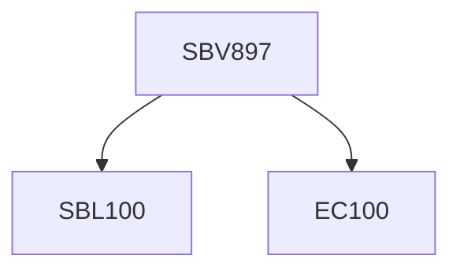

**Credits:** 1 (1-0-0)

**Prerequisites:** Pre-requisite(s): EC100 and [[/Biological Sciences/SBL100|SBL100]] for UG students

#### Description
Angiogenesis and vasculogenesis; the lymphatic system; introduction to blood vessels: types, structure, and composition. Blood vessel components – endothelial cells, pericytes, and vascular smooth muscle cells; vascular endothelial growth factor (VEGF) biology – its role in angiogenesis and vascular permeability; basic fibroblast growth factor biology; VEGF and FGF receptors, tyrosine kinase signaling and activation; angiogenesis and immune system; tumor angiogenesis - Judah Folkman hypothesis, discovery and how the field of vascular biology in cancer has evolved over the years; tumor vasculature and perfusion; antiangiogenesis as a current therapeutic strategy – where we stand?; blood vessel inhibition vs normalization; vessel co-option and vascular mimicry; atherogenesis; anti-angiogenic therapy in age- related macular degeneration; Vascular aging; different in vitro, in vivo, and ex vivo models to study vascular biology.

### Prerequisite Tree

