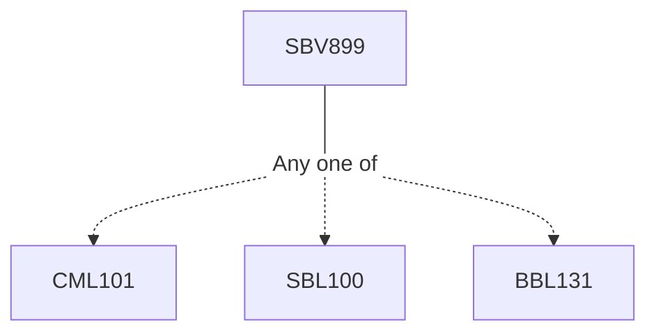

**Credits:** 1 (1-0-0)

**Prerequisites:** [[/Chemistry/CML101|CML101]] or [[/Biological Sciences/SBL100|SBL100]] or [[/Biochemical Engineering and Biotechnology/BBL131|BBL131]] for UG students. None for PG students.

#### Description
Protein and nucleic acid quantification assays- spectrophotometric- and fluorometric methods, qPCR. Assays for monitoring receptor- drug interaction – radioactivity-, fluorescence-, luminescence-, surface plasmon resonance (SPR)- and flow cytometry-based assays. Enzyme kinetics and inhibition assays – Basics of enzyme Kinetics, biochemical assays for miscellaneous therapeutically relevant enzymes, different modes of enzyme inhibition and assays for studying the mechanism of action, high-throughput screening assays. Immunoassays- radioimmunoassay (RAI), enzyme-linked immunosorbent assay (ELISA), miscellaneous applications. Protein- protein interaction inhibition assays – ELISA-type, fluorescence-based and immunoprecipitation assays for monitoring inhibition of protein- protein interaction. Cell viability and cytotoxicity assays – assays relying on reduction of tetrazolium and resazurin compounds, activity of protease markers, ATP detection, real-time assay for viable cells, dye- and marker-based analysis of dead cells. Cellular thermal shift assay (CETSA) – basic principle and miscellaneous applications, high throughput CETSA, MS-CETSA. Assays for ADME/Pharmacokinetic parameters – Assays for evaluating lipophilicity, aqueous solubility, microsome stability, plasma stability, plasma protein binding, membrane permeability, cytotoxicity, cytochrome P450 inhibiton, tmax, Cmax, t1/2, area-under-curve (AUC) etc.

### Prerequisite Tree

