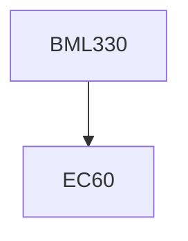

**Credits:** 3 (3-0-0)

**Prerequisites:** EC 60

#### Description
Value theory-Risk and Reliability-Decision theory. Injury and damage control. Epidemiology of accidents. Human tolerance to energy inputs. Biomedical/biomechanical aspects of long term exposure to hazardous environment. Socio-technical aspects of safety standards. Case studies of well known disasters.

### Prerequisite Tree

