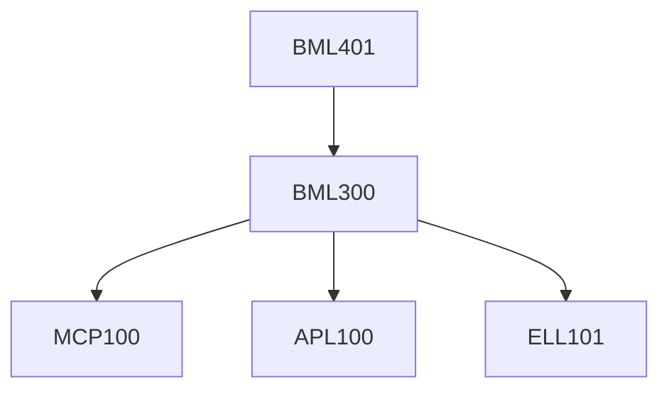

**Credits:** 3 (2-0-2)

**Prerequisites:** [[/Biomedical Engineering/BML300|BML300]]

#### Description
Introduction to major healthcare problems and challenges in India, Healthcare Start-up ecosystem in India, Academia vs Industry, Customer Requirements and Psychology, Healthcare Product Idea and Implementation Strategy, Team Building, Business Model Development, Bootstrapping Startup (i.e., How to minimize cost and resources).

Critical review of healthcare products and business ideas presented by students, and team building. Effective Customer Survey, Market Competition (analysis of novelty, need, barrier to entry, cost and resources), Product features. Low-cost Product development and Short-Term Funding Avenues, Grant Writing.

Product Beta Testing (Identification and use of in-house facilities and outsourcing) and Clinical Testing. Regulatory Approvals, Quality Standards, and Intellectual Property. Short-term pilot study to understand customer acceptance. Product Launching Avenues (Online/Distributor/Crowdfunding). Customer Engagement (social media, Word-of-mouth, partners). PASS/FAIL Project Review. Startup company formation steps. Biomedical Startup Scalability and Sustainability.

Group Project, healthcare product development and deployment (Online/Distributor/Crowdfunding): Hands on.

### Prerequisite Tree

