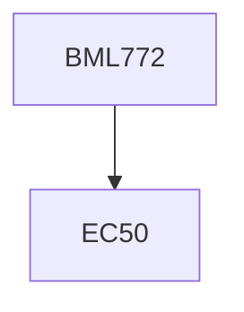

**Credits:** 3 (2-0-2)

**Prerequisites:** 50 Credits

#### Description
Introduction; bioprinting tissues, bones and cartilages; self-assembly, directed assembly, enzymatic assembly; laser-assisted bio-printing; fabrication of scaffolds (hydrogel method and fibre based); artificial bacteria (active/passive drug delivery, microswimmer); component fabrication (stereolithography, laser machining etc); mass production (stamping, micro-injection molding etc). Experiments: CAD (solidworks) and data import (from MRI/CT) - hands-on; Fused deposition molding (3D printing) - hands on; Fused deposition molding (3D printing) - hands on; Tissue & Organ printing (3D organ printer) - demonstration only; Scaffold generation - Hydrogel (Wet Chemistry) and Fibres (electrospinning) - hands on; Laser machining
- hands on; Mask generation (E-beam lithography and focussed ion beam) -demonstration only; Characterization (Imaging, Profilometry, optical scanner) - hands on; Stamping - hands on; Micro-injection molding - demonstration only.

### Prerequisite Tree

