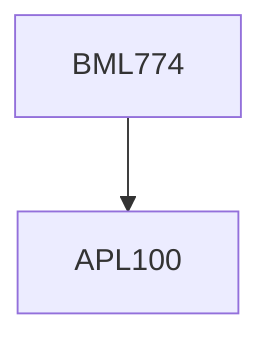

**Credits:** 4 (3-0-2)

**Prerequisites:** [[/Applied Mechanics/APL100|APL100]] for B.Tech students of all departments

#### Description
Introduction to soft tissues. Review of major tissues and properties (skin, muscles, connectives tissues). Study of anatomy and biomechanical properties of tissues in all functional organs (e.g., brain, lungs, heart). Blood vessels, and extremities. Biochemical testing methods: In vivo and in vitro. Test protocol for soft tissue testing. Linear and non-linear mechanical properties. Effect of specimen size, varying strain rates, and loading orientation. Mechanical testing with cadaveric tissues and soft tissue simulants. Finite element modelling of soft tissues. Study of digital image correlation (DIC). Hyperelastic constitutive materials models (e.g., Mooney-Rivlin, Ogden). Soft tissue degradation modes. Characterizing tissue weakening (age) and injury. Effect of impact loads. Soft tissue failure criteria, and fracture modes. Effect of wounds on soft tissues properties. Soft tissue biomechanics due to wound healing. Interaction of Soft tissues with interventions and medical devices. Effect of suturing, implantation, penetration, and frictional interactions on soft tissues properties. Project work: comparison of biomechanics properties of soft tissue samples through experiments, material characterization, DIC, and finite element simulations.

### Prerequisite Tree

