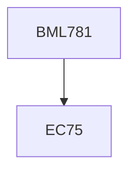

**Credits:** 3 (2-0-2)

**Prerequisites:** 75 Credits for UG students

#### Description
Introduction: a. Bones, tissues and muscles, b. Properties; 2. Orthopedic requirements: a. Static and dynamic loads b. Kinematics and Kinetics c. Bone healing, wound healing and remodeling; 3. Strength, wear and corrosion of orthopedic devices a. Static strength b. Impact & fatigue strength c. Wear and d. Biochemical erosion and corrosion and e. biofilms; 4. Design of (a) orthopedic prosthesis for Wrist fracture, elbow arthroplasty, shoulder fracture, total hip replacement, spine fracture, femur fracture, total knee replacement, ligament arthroplasty, and tibia fractures (b) orthotics for foot abnormalities (c) methods to avoid re-occurance of bone fracture and (d) modeling of bone; 5. Manufacturing techniques; 6. Regulatory requirements: Testing and certification; 7. Orthopedic devices case studies.

### Prerequisite Tree

