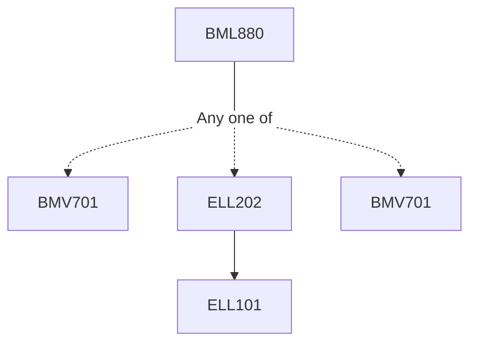

**Credits:** 3 (2-0-2)

**Prerequisites:** [[/Biomedical Engineering/BMV701|BMV701]] for CBME students with background in sciences and medicine. [[/Electrical Engineering/ELL202|ELL202]] or [[/Biomedical Engineering/BMV701|BMV701]] for B.Tech. students of other departments.

#### Description
History and evolution of wearable devices, social aspects of wearability, biochemical sensors, optical and acoustic sensors, smart materials for sensor and actuator design, bioelectronics for wearable applications – flexible circuit design, power considerations, energy storage methods, energy harvesting, biodesign of wearable technology- measurement, mechanical design and prototyping, design for usability and ergonomics: target customer discovery, surveys, market competition and statistic, emerging applications in rehabilitation – soft-robotic devices and assistive devices. Neuromodulation and neural recording applications, wearable haptics and biofeedback systems. Signal processing techniques and machine learning methods in wearable devices.

### Prerequisite Tree

