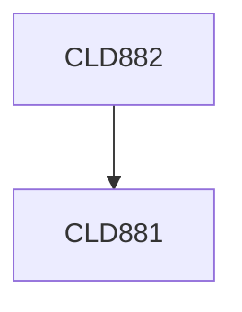

**Credits:** 12 (0-0-24)

**Prerequisites:** [[/Chemical Engineering/CLD881|CLD881]]

#### Description
Formulation of the problem, literature survey, design and fabrication of the experimental setup, study of experimental techniques in the case of experimental projects, formulation of equations and analytical/numerical solution in case of modeling projects, development of software, analysis and interpretation of results, writing technical report, presentation of results and scientific reporting in form or thesis and presentation.

### Prerequisite Tree

