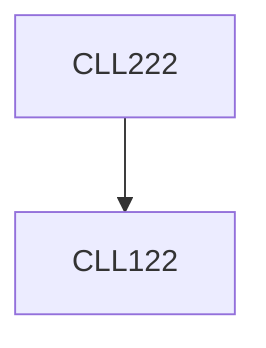

**Credits:** 3 (3-0-0)

**Prerequisites:** [[/Chemical Engineering/CLL122|CLL122]]

#### Description
Definition of catalysis, homogeneous and heterogeneous catalysis. Adsorption on catalytic surfaces, kinetic models, catalyst preparation, physical characterization of catalysts, supported metal catalysts.

Mass transfer and internal diffusion effects in catalytic reactions, Thiele modulus and effectiveness factor, falsification of kinetics, catalyst deactivation.

Packed bed reactor design, introduction to other multiphase reactors, gas-liquid reactors and enhancement factor. Gas-solid non- catalytic reactions.

### Prerequisite Tree

