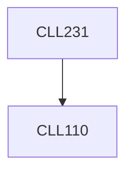

**Credits:** 4 (3-1-0)

**Prerequisites:** [[/Chemical Engineering/CLL110|CLL110]]

**Overlaps with:** APL107, APL106, APL105

#### Description
Introduction to fluids, Forces on fluids, Fluid statics, Hydrostatic force on submerged bodies, Rigid body motion, Kinematics of flow
- Eulerian and Lagrangian descriptions, Flow visualization, Integral analysis - mass and momentum balances, Bernoulli equation, Flow through pipes and ducts, Flow measurement, Flow transportation
- pumps, blowers and compressors, Differential analysis of flow, Conservation of mass, linear and angular momentum, Navier-Stokes equation, Unidirectional flows, Viscous flows, Skin friction and form friction, Lubrication approximation, Potential flows, Boundary layer theory, Blasius equation for flow over a flat plate, Boundary layer separation, Drag and lift force on immersed bodies, Similitude analysis, Turbulent flows.

### Prerequisite Tree

