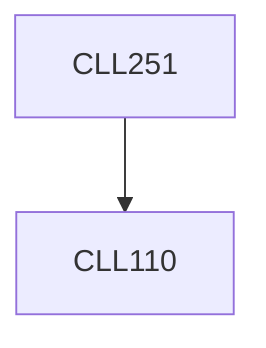

**Credits:** 4 (3-1-0)

**Prerequisites:** [[/Chemical Engineering/CLL110|CLL110]]

**Overlaps with:** MCL242

#### Description
Modes of heat transfer - conduction, convection, radiation; Heat transfer coefficients in natural and forced convection; Basic conservation equations; Heat transfer with phase change; Design of double pipe heat exchangers, shell and tube heat exchangers and evaporators; Introduction to radiative heat transfer. Unsteady state heat transfer. Two-dimensional heat transfer problems.

### Prerequisite Tree

