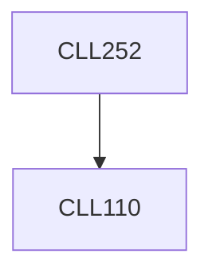

**Credits:** 3 (3-0-0)

**Prerequisites:** [[/Chemical Engineering/CLL110|CLL110]]

#### Description
Lattice, Fick’s, Stefan-Maxwell, Stokes-Einstein and irreversible thermodynamic approaches to diffusivity of binary and multicomponent system. Film theory and other theories of mass transfer. Analogy and correlation approaches to mass transfer coefficients in interphase mass transfer. Analysis of co-current, counter-current and cross flow stage cascades. Design and operating conditions of differential contact equipment such as packed towers for absorption, adsorption, drying and leaching.

### Prerequisite Tree

