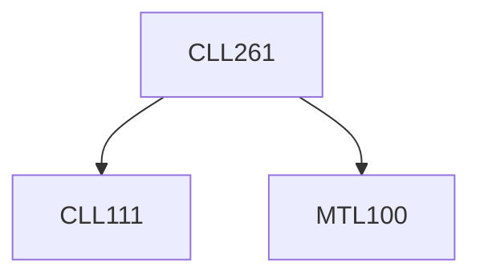

**Credits:** 4 (3-1-0)

**Prerequisites:** [[/Mathematics/MTL100|MTL100]], [[/Chemical Engineering/CLL111|CLL111]]

**Overlaps with:** MCL212, ELL225, ELL205

#### Description
Introduction to automation, block diagrams; revision of Laplace transform. Modeling based on transfer function approach, open-loop systems: dynamic response of first order systems, first order systems in series, second order systems, and transportation lag. Feedback control: P, PI, PID controllers. Dynamic response of closed loop systems Linear stability analysis: Routh stability criterion, root locus diagrams. Frequency response: Bode diagrams, Nyquist diagrams, Bode and Nyquist stability criterion. Controller tuning: Zeigler- Nichols and Cohen-Coon methods. Introduction to advanced control: feedforward control, cascade control, dead time compensation, ratio control, internal model control.

### Prerequisite Tree

