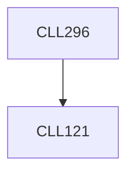

**Credits:** 3 (3-0-0)

**Prerequisites:** [[/Chemical Engineering/CLL121|CLL121]]

**Overlaps with:** PYL421

#### Description
Mathematical characterization of phase transitions in soft matter, e.g.

thin films, polymers and colloidal suspensions. Universality in phase separation kinetics. Evolution of order parameter. Time dependent mean field theories (MFTs). Kinetically-driven morphological changes in nano-pattern formation in thin films. Colloidal crystallization and at liquid fronts. Field-induced effects on assembly in complex fluids.

### Prerequisite Tree

