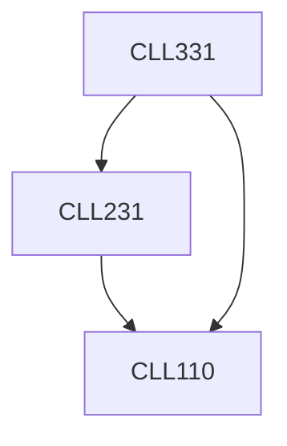

**Credits:** 4 (3-1-0)

**Prerequisites:** [[/Chemical Engineering/CLL110|CLL110]], [[/Chemical Engineering/CLL231|CLL231]]

#### Description
Introduction to industries dealing with the particles (solid, liquid, gas, soft-materials: colloids, polymer), solid particles: particle size, shape and their distribution, relationship among shape factors and particle dimensions, specific surface area, measurement of surface area and particle size distribution, drag coefficient, packed bed, fluidization.

Sedimentation: settling, hindered settling, design of settling tank, filtration, centrifugal separation, cyclone separator, mixing (solid-solid, solid-liquid and liquid-liquid), segregation.

Size reduction, size enlargement, flow properties of slurries, behaviour of colloidal particles in dispersed condition.

### Prerequisite Tree

