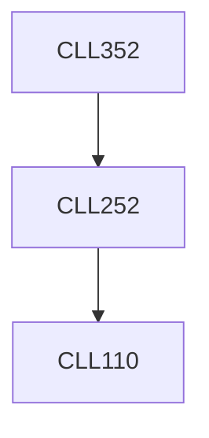

**Credits:** 4 (3-1-0)

**Prerequisites:** [[/Chemical Engineering/CLL252|CLL252]]

#### Description
Review of VLE. Separation quantification: separation factor, relative volatility, key components, flash: graphical and algebraic (Richford- Rice) method. Differential distillation, binary distillation: McCabe- Thiele method - minimum reflux, minimum number of stages, open steam, multiple feeds, side streams. Packed columns - HETP, HTU method. Column pressure. Tray efficiency. Column sizing, sieve tray design, packed column design.

LLE - equilibrium diagram, selection of solvent, design calculations for single stage, cascade of stages using Hunter and Nash graphical method, McCabe-Thiele method, continuous contacting.

Multicomponent system: selection of key components, approximate - FUG method, DOF for cascade of stages, MESH formulation, introduction to azeotropic and extractive distillation, adsoption equilibrium, breakthrough curve.

### Prerequisite Tree

