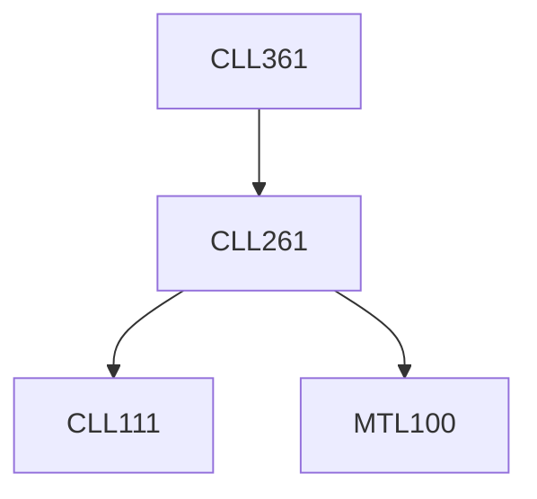

**Credits:** 2.5 (1-0-3)

**Prerequisites:** [[/Chemical Engineering/CLL261|CLL261]]

#### Description
Signals and standards (pneumatic, voltage, current). Basics of control loop components: sensors, transmitters, transducers, control valves, and converters. Measurement devices for process variables: temperature, pressure, level, flow, pH, humidity, density, and viscosity. Control valves, actuators, positioners; computer-based control systems: PLC, DCS, SCADA.

### Prerequisite Tree

