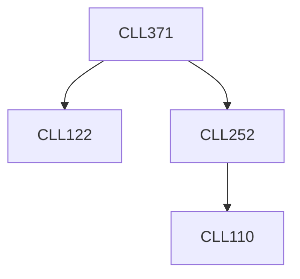

**Credits:** 4 (3-1-0)

**Prerequisites:** [[/Chemical Engineering/CLL252|CLL252]], [[/Chemical Engineering/CLL122|CLL122]]

#### Description
Introduction to process flowsheet, equipment symbols and sections of a chemical plant. Use of flowsheeting software. Process synthesis and process flow diagrams of chemical plants (gas-liquid, liquid- solid, gas-liquid-solid handling plants). Fertilizer technology: manufacture of fertilizers including naphtha reforming, air separation, ammonia synthesis technology. Utilities and safety issues in fertilizer plants. Chlor-alkali and sulfuric acid manufacturing. Refining and petrochemical technology: Crude occurrence, properties, distillation, refinery processes and technology, petrochemical technologies. Semi- conductor chip manufacturing. food technology. Safety and hazard analysis, and debottlenecking of chemical plants. Introduction to process engineering economics.

### Prerequisite Tree

