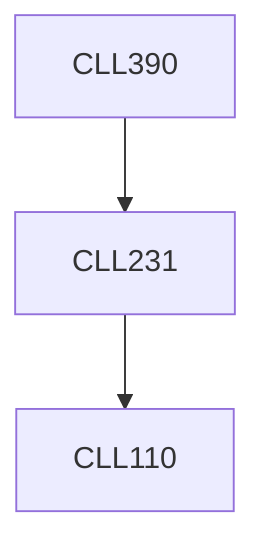

**Credits:** 3 (3-0-0)

**Prerequisites:** [[/Chemical Engineering/CLL231|CLL231]]

#### Description
Transportation and measurement of utilities like air, water and steam.

Handling of steam. Design of insulation for steam carrying pipes, water hammer. Design of flash tank. Water treatment and reduction of scaling. Storage tank analysis for water. Piping network design, fittings and valves. Air treatment: cleaning and Dehumidification, design of refrigeration and air-conditioning systems. Transportation of air: duct design, selection of blowers and compressors. Instrumentation and control for fluid transportation. Energy audit for industrial air and steam handling systems.

### Prerequisite Tree

