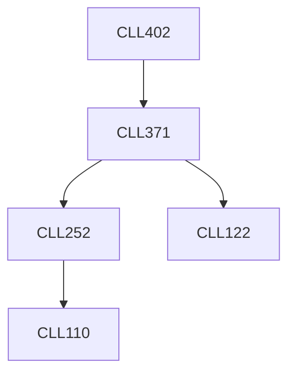

**Credits:** 3 (3-0-0)

**Prerequisites:** [[/Chemical Engineering/CLL371|CLL371]]

**Overlaps with:** CLL703

#### Description
Plant layout and flowsheeting. Issues related to materials handling, equipment selection and design (pumps, blowers and compressions, mixers, conveyors, seperation columns, reactors), utilities and auxiliaries, offsite facilities. Cost estimation. Selection and detailed design of equipment. Steam handling. Valves, piping and instrumentation. Environmental footprint assessment, pollution reduction, and life cycle analysis of process plant.

### Prerequisite Tree

