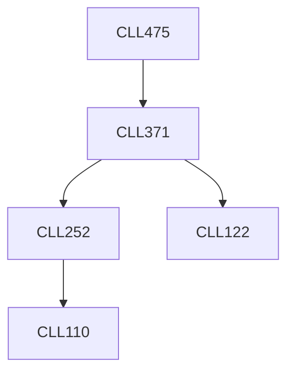

**Credits:** 3 (3-0-0)

**Prerequisites:** [[/Chemical Engineering/CLL371|CLL371]]

#### Description
Loss statistics and prevention. Fires and explosions. Hazards related to static electricity. Safety system designs for prevention of fire and explosions. Hazards due to toxicity. Industrial hygiene. Hazards identification and risk assessment methods. Event probability and failure frequency analysis. Case studies.

### Prerequisite Tree

