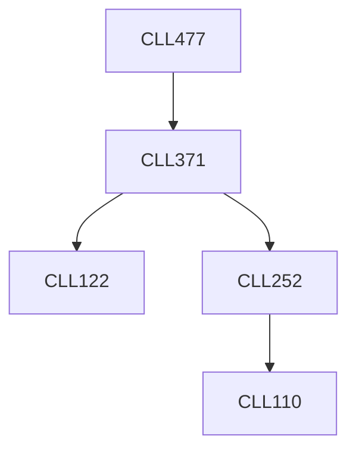

**Credits:** 3 (3-0-0)

**Prerequisites:** [[/Chemical Engineering/CLL371|CLL371]]

#### Description
Types and mechanisms of corrosion, factors influencing corrosion. Corrosion testing methods. Combating corrosion in metals and non- metals. High and low temperature materials. Selection of materials of construction for handling different chemicals. Industrial applications and case studies.

### Prerequisite Tree

