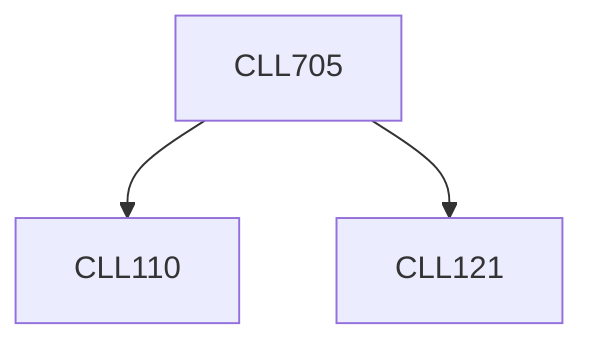

**Credits:** 3 (3-0-0)

**Prerequisites:** [[/Chemical Engineering/CLL110|CLL110]], [[/Chemical Engineering/CLL121|CLL121]]

#### Description
Introduction of static model including porosity, permeability, compressibility and saturations. Crude oil phase behaviour and their measurement techniques for reservoir and laboratory settings. Meaning and calculation of ‘oil in place’ numbers with respect to different recovery mechanisms. Material balance for hydrocarbon reservoirs. Pressure transient analysis. Primary, secondary and tertiary recovery mechanisms, Buckley- Leverett theory (fractional flow curves) for immiscible and miscible displacement. Production forecasting and introduction to reservoir simulation.

### Prerequisite Tree

