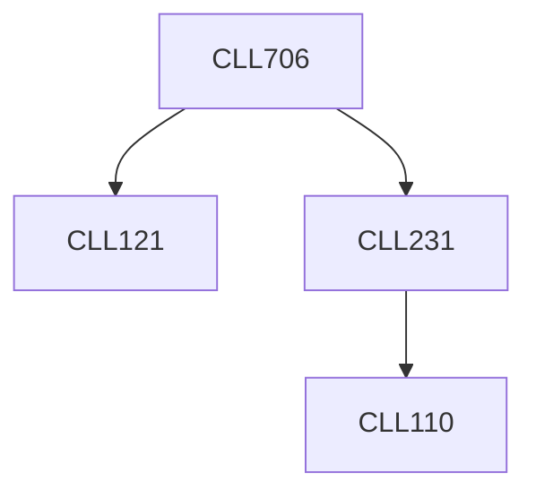

**Credits:** 3 (3-0-0)

**Prerequisites:** [[/Chemical Engineering/CLL231|CLL231]], [[/Chemical Engineering/CLL121|CLL121]]

#### Description
Basic concepts: well drilling, well completions, drive mechanisms for different reservoirs, Darcy’s law. Movement of fluids in the well, different artificial lift mechanisms, VLP (vertical lift performance curves), IPR (inflow performance relationships). Well analysis tools (different well performance curves, well logging). Problem identification in wells (examples). Well stimulation techniques.

### Prerequisite Tree

