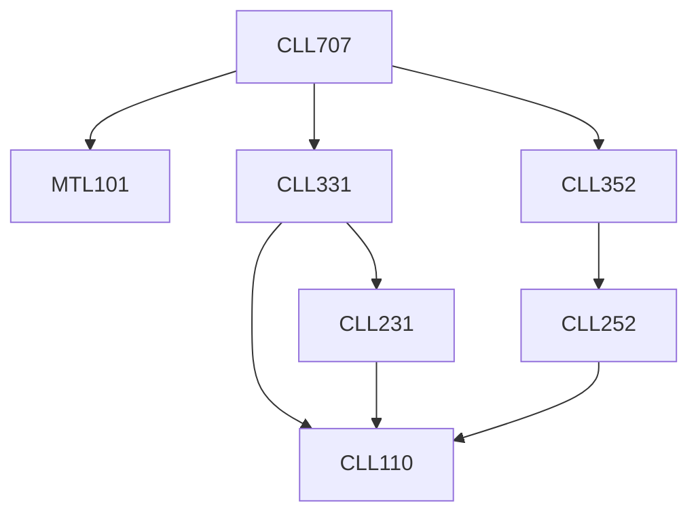

**Credits:** 3 (3-0-0)

**Prerequisites:** [[/Mathematics/MTL101|MTL101]], [[/Chemical Engineering/CLL331|CLL331]], [[/Chemical Engineering/CLL352|CLL352]]

#### Description
Theory of crystallization. Particle size distribution, particle phase space. Population balance equation for convection in state space (pure growth). Solution of PBE using method of characteristics. PBE with breakage and coalescence/aggregation terms. Scaling theory and phenomenological models for rate of breakage and coalescence induced by turbulence. Solution of PBE for pure breakage and pure coalescence. Moment transformation of PBE. Numerical approaches to solve PBE. Integrating PBE with transport equations.

### Prerequisite Tree

