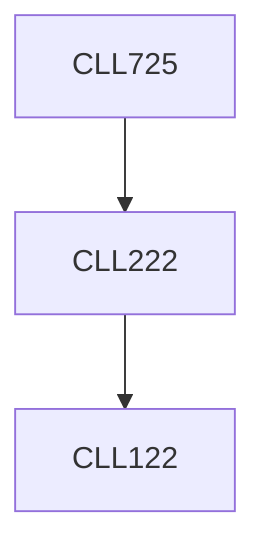

**Credits:** 3 (3-0-0)

**Prerequisites:** [[/Chemical Engineering/CLL222|CLL222]]

#### Description
Overview of air pollution from mobile and stationary sources. Modeling of emission profile from IC engine. Effect of fuel type and quality and engine performance on air quality. Automotive catalysts and monoliths. Diesel particulate filters and their operation. Selective catalytic reduction. Stationary sources of air pollutants. Household pollutants and control of indoor air quality. Control of pollutants from power plants.

### Prerequisite Tree

