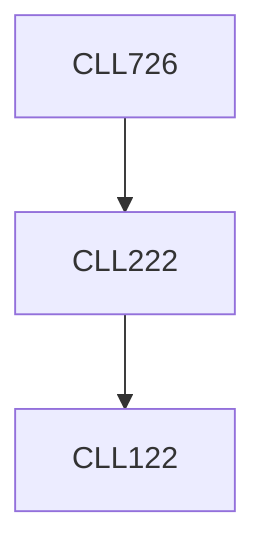

**Credits:** 3 (3-0-0)

**Prerequisites:** [[/Chemical Engineering/CLL222|CLL222]]

#### Description
Sabatier principle. Catalytic cycle, transition state theory. Ensemble effect, defect sites, cluster size effects, metal-support interactions, structural effects, quantum size effects, electron transfer effects. BrØnsted-Evans-Polanyi relations. Reactivity of transition-metal surfaces, quantum chemistry of chemical bond, bonding to transition metals, chemisorption.

Kinetics of elementary steps (adsorption, desorption and surface reactions). Reaction on uniform and non-uniform surfaces. Structure- sensitive and non-sensitive reactions on metals.

Electronic structure methods, potential energy surface, Born– Oppenheimer approximation, Hartree-Fock theory, self-consistent field, Kohn-Sham Density Functional Theory, Bloch’s theorem and plane wave basis set, exchange-correlation functionals, pseudo- potential. Search for transition state, dimer method, nudged elastic band method, density of states.

Catalysis by metals, oxides, sulfides and zeolites. Aqueous phase heterogeneous catalysis and electrocatalysis.

### Prerequisite Tree

