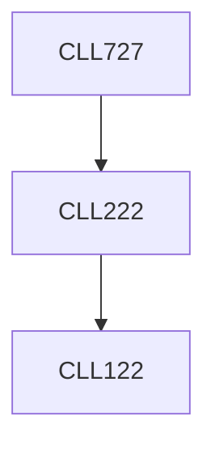

**Credits:** 3 (3-0-0)

**Prerequisites:** [[/Chemical Engineering/CLL222|CLL222]]

#### Description
Overlaps with: Basic concepts in heterogeneous catalysis, catalyst preparation and characterization, poisoning and regeneration. Industrially important catalysts and processes such as oxidation, processing of petroleum and hydrocarbons, synthesis gas and related processes. Commercial reactors: adiabatic and multi-tubular packed beds, fluidized bed, trickle-bed, slurry reactors. Heat and mass transfer and its role in heterogeneous catalysis. Calculations of effective diffusivity and thermal conductivity of porous catalysts. Reactor modeling. Chemistry and engineering aspects of catalytic processes along with problems arising in industry. Catalyst deactivation kinetics and modeling.

### Prerequisite Tree

