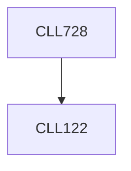

**Credits:** 3 (3-0-0)

**Prerequisites:** [[/Chemical Engineering/CLL122|CLL122]]

#### Description
Critical analysis of issues associated with implementing large scale biofuel and biomass energy production. Processes for converting feedstocks to biofuels by thermochemical methods. Biomass conversion catalysis, kinetics and reaction mechanisms, reactor design and scale up issues.

### Prerequisite Tree

