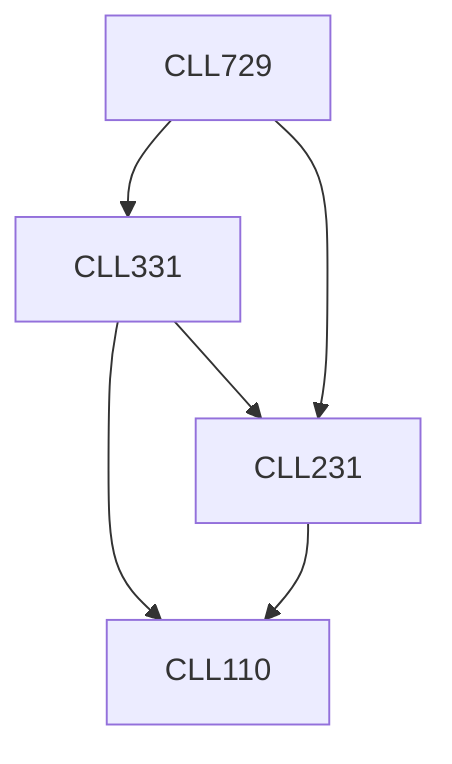

**Credits:** 3 (3-0-0)

**Prerequisites:** [[/Chemical Engineering/CLL231|CLL231]], [[/Chemical Engineering/CLL331|CLL331]]

#### Description
Creeping flows around a sphere. Drag and lift forces acting on particles in viscous fluids. Brownian motion of small particles. Colloidal interactions like van der Waal forces, electrostatic forces, depletion interactions, steric hindrance. Introduction to aerosols and colloids. Rheology of dilute, concentrated suspensions of spherical particles. Dynamics of nonspherical particles in viscous fluids. Rheology of non-spherical particles. Coagulation/coalescence due to differential settling, shear flow, Brownian diffusivity. Methods of preparation of emulsions, high energy and low energy. Microemulsions vs nanoemulsions. Aerosol characterization, transport of particulate matter in air via diffusion, convection and inertia, removal of particles via dry and wet deposition. Formation of aerosol (or colloidal) particles via nucleation and growth. Population balance equation. Experimental techniques for aerosol chemical characterization.

### Prerequisite Tree

