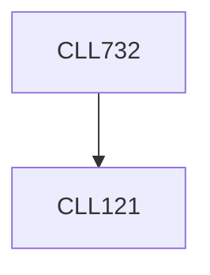

**Credits:** 3 (3-0-0)

**Prerequisites:** [[/Chemical Engineering/CLL121|CLL121]]

#### Description
First and second law of thermodynamics. Application in analysis of energy and efficiency of equipment, flow through equipment. State and behavior of materials, degree of freedom analysis. Material properties as a function of conditions. Relationships between material properties, and changes in material properties. Equilibrium properties of materials: pure materials, and mixtures. A-priori probability postulate, ergodic hypothesis, introduction to microcanonical, canonical and grand canonical ensembles, derivation of physical properties for pure components and mixtures, ideal gas and lattice gas, virial coefficient calculations. Crystal structures, solutions, modeling and analysis of adsorption phenomena, relating them to macroscopic thermodynamics.

### Prerequisite Tree

