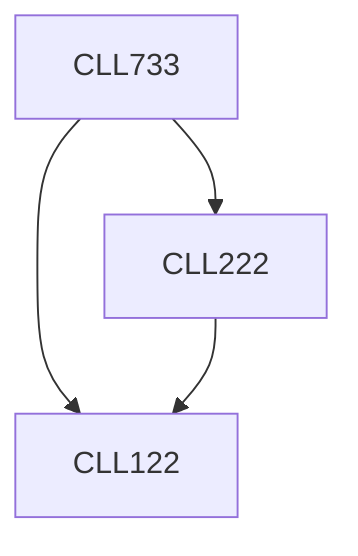

**Credits:** 3 (3-0-0)

**Prerequisites:** [[/Chemical Engineering/CLL122|CLL122]], [[/Chemical Engineering/CLL222|CLL222]]

#### Description
Introduction to advanced reactor analysis tools: RTD theory, RTD based models, axial dispersion, tank-in-series, multizonal models. Hydrodynamics and flow regimes. Transport effects in multiphase reactors, interplay of length and time scales. Process parameters of interest. Effectiveness factors in G/S and L/S systems, including non-isothermal effects. Enhancement factor in G/L systems. Models for non-catalytic heterogeneous reactions. Introduction to multiphase reactors and their applications, classification of multiphase reactors, performance/operating characteristics. Mechanically agitated reactors, bubble column/slurry bubble column reactors, fluidized bed, packed bed, trickle bed reactor reactors. Limitations of models, applications to design of multiphase reactors for specific applications.

### Prerequisite Tree

