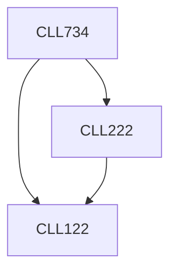

**Credits:** 3 (3-0-0)

**Prerequisites:** [[/Chemical Engineering/CLL122|CLL122]], [[/Chemical Engineering/CLL222|CLL222]]

#### Description
Introduction to process intensification, possible ways of process intensification and their examples. Introduction to multifunctional reactors/process equipment: reactive distillation, reactor-heat- exchangers. membrane reactors, micro-reactors, structured/ monolithic reactors. Intensification of conventional reactors/process equipments, analysis of fluid dynamics and transport effects of intensified reactors. Order of magnitude analysis of reaction rates, heat/mass transfer rates. Flow patterns in intensified reactors. Design and scale of intensified reactors, fabrication issues. Examples of process intensification.

### Prerequisite Tree

