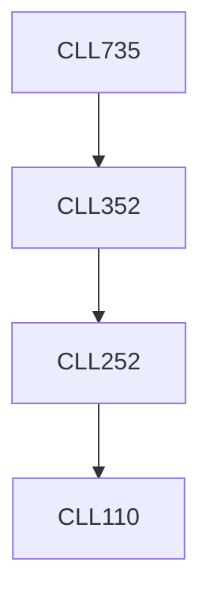

**Credits:** 3 (3-0-0)

**Prerequisites:** [[/Chemical Engineering/CLL352|CLL352]]

#### Description
Overview of multi-component separation. Non-ideal solution and properties, equation of state, vapour liquid equilibrium. Multi component separation: Short cut method, rigorous calculations - sum rate, boiling point and Newton’s methods, inside-out method for designing of multi-component distillation, absorption and extraction column / contacting devices. Choice of column: tray, random packing and structured packing. Design of adsorption and ion exchange column. Crystallization. Affinity separation and chromatographic separation. Optimal reflux ratio (recycle stream) - operating expenditure versus capital expenditure for all types of columns and contacting devices.

### Prerequisite Tree

