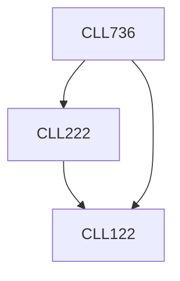

**Credits:** 3 (3-0-0)

**Prerequisites:** [[/Chemical Engineering/CLL122|CLL122]], [[/Chemical Engineering/CLL222|CLL222]]

#### Description
Analytical techniques: Introduction to various analytical techniques e.g. GC, HPLC, UV Spectroscopy, TGA /DTA, FTIR, MS, GCMS, NMR, TOC, CHONS. Principle of measurement techniques, instruments and procedures. Calibration, data processing, analysis and interpretation. Few working demonstrations.

Catalysis characterization: Introduction to various catalysis preparations and characterization techniques, e.g. porosity, surface area, pore volume and pore size distribution (using BET), XRD, SEM, TEM, NMR, AFM, ESCA. Mossabauer spectroscopy, chemisorption, TPD / TPR.

Flow characterization: Introduction to single/multiphase flows/ reactors, role of hydrodynamics. Process parameters of interest, length and time scales, instantaneous vs. time averaged characteristics. Introduction to various advanced intrusive and non-intrusive flow measurement technqiues, e.g. mininaturized pressure probes, gamma-ray tomography, densitometry, PIV, RPT, ECT/ERT, high speed photography, tracers and radiotracers.

### Prerequisite Tree

