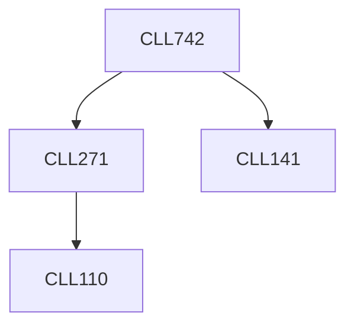

**Credits:** 3 (3-0-0)

**Prerequisites:** [[/Chemical Engineering/CLL141|CLL141]], [[/Chemical Engineering/CLL271|CLL271]]

**Overlaps with:** MLL723

#### Description
Theory and working principles of analytical instruments including high performance liquid chromatography (HPLC), ultra-high performance liquid chromatography (UPLC), capillary electrophoresis (CE), capillary isoelectric focusing (cIEF), gel electrophoresis, circular dichroism (CD) spectroscopy, Fourier transform infrared spectroscopy (FTIR), mass spectroscopy (MS), atomic force microscopy (AFM), scanning electron microscope (SEM), differential scanning calorimetry (DSC), ultraviolet (UV) spectroscopy, surface plasmon resonance (SPR), 2D gel electrophoresis, fluorescence spectroscopy, Zeta-meter, contact angle goniometer, oscillatory drop module (ODM) of goniometer, and quartz crystal microbalance (QCM). Hands-on experience on characterization of proteins. Case studies in biotech industry.

### Prerequisite Tree

