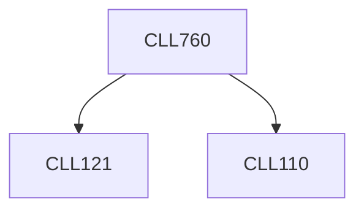

**Credits:** 3 (3-0-0)

**Prerequisites:** [[/Chemical Engineering/CLL110|CLL110]], [[/Chemical Engineering/CLL121|CLL121]]

#### Description
Fundamental aspects of crystal growth – role of controlling parameters; Intermolecular interaction between solution species and surface of crystals; Nucleation and growth mechanism, kinetics and limitations; Spinal decomposition– mean-field and non-linear models; Kinetics of frontal growth; Models for 2d and 3d growth; Various analytical tools to characterize the phenomena of crystal formation and growth – static and dynamic light scattering; scanning probe microscope, optical microscopy, time-resolved techniques for crystallization kinetics; Modelling of crystallization kinetics; Industrial relevance and design aspects; Real-life problems in crystal engineering.

### Prerequisite Tree

