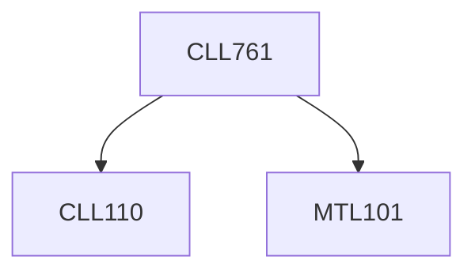

**Credits:** 3 (3-0-0)

**Prerequisites:** [[/Mathematics/MTL101|MTL101]], [[/Chemical Engineering/CLL110|CLL110]]

#### Description
Classification, estimation and propagation of errors. Presentation of data. Statistical methods: sample and population distributions, testing of hypothesis, analysis of variance.

Vector spaces, basis, matrices and differential operators. Eigen values, vectors and functions. Solvability conditions for linear equations. Frobenius method for ordinary differential equations. Sturm-Louiville Theorem: Separation of variables and Fourier transform. Green’s function and its applications.

### Prerequisite Tree

