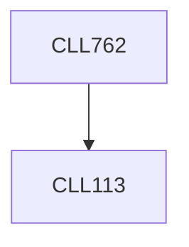

**Credits:** 3 (2-0-2)

**Prerequisites:** [[/Chemical Engineering/CLL113|CLL113]]

**Overlaps with:** APL703

#### Description
Introduction to models in Chemical Engineering. Formulation of problems leading to ODEs of initial value types. Stability and stiffness of matrices. Solution of stiff problems like Rober’s problem in autocatalytic reactions by Gear’s algorithm. Formulation of problems leading to steady state ODEs of boundary value types. Different weighted residual methods to solve BVPs. Orthogonal collocation and Galerkin finite element method. Application to reaction diffusion in porous catalysts pellets under non-isothermal conditions, calculation of effectiveness factor. Moving boundary problems. Transient problems leading to PDEs. Examples in heat and mass transfer and their numerical solution: orthogonal collocation. Monte Carlo method and its applications. Introduction to LBM method to solve fluid flow problems.

### Prerequisite Tree

