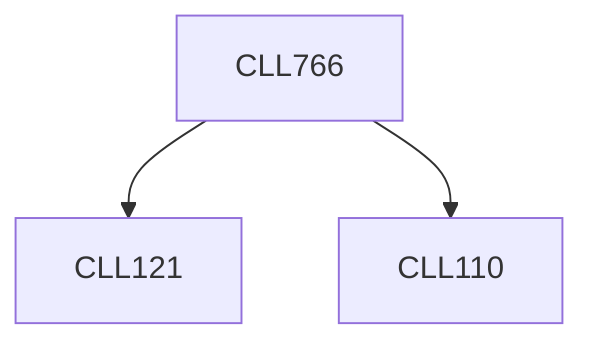

**Credits:** 3 (3-0-0)

**Prerequisites:** [[/Chemical Engineering/CLL110|CLL110]], [[/Chemical Engineering/CLL121|CLL121]]

#### Description
Concept and definition of interface. Physical surfaces. Surface chemistry and physics of colloids, thin films, dispersions, emulsions, foams, polyaphrons. Interfacial processes such as crystallization, epitaxy, froth flotation, adsorption, adsorptive bubble separation, catalysis, reaction-injection moulding, microencapsulation. Industrial aspects of interfacial engineering.

### Prerequisite Tree

