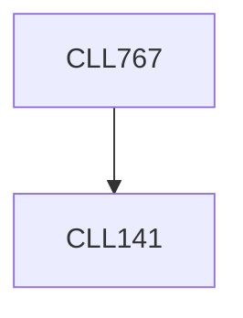

**Credits:** 3 (3-0-0)

**Prerequisites:** [[/Chemical Engineering/CLL141|CLL141]]

**Overlaps with:** MLL721, MLL719, TTL712

#### Description
Overview of polymer science and engineering with reference to polymer-solution. Chain dimension: variation of chain dimension with concentration, solvency etc., scaling theory. Molecular weight distribution and its effect on properties of polymer solution. Polymer solution thermodynamics: Flory-Huggins equation and its development, phase separation. Polymer in good, theta and poor solution. Colligative properties of polymer solution. Flow phenomena in polymeric liquids. Material functions for polymeric liquids. General linear viscoelastic fluid: Rouse dynamics, Zimm dynamics. Hyper branched polymer and its physical properties in various solutions. Dynamics of entangled polymers - polymer melt, chain reptation, tube model, chain length fluctuations. Convective constraint release.

### Prerequisite Tree

