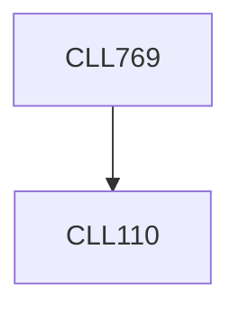

**Credits:** 3 (2-0-2)

**Prerequisites:** [[/Chemical Engineering/CLL110|CLL110]]

**Overlaps with:** APL410, APL720, MCL813

#### Description
Introduction and review of fundamentals of CFD. Numerical simulations of turbulent flows: RANS approach; Introduction to Large Eddy Simulation (LES) and Direct Numerical Simulations (DNS). Numerical simulations of multiphase flows. Two-fluid and Multi-fluid Euler-methods; Discrete particle (Euler-Lagrange) methods; Interface tracking/capturing methods (Volumne of Fluid Methods) (Volume of Fluid Method). Applications of these Methods to simulate dispersed gas-liquid, gas-solid flows in bubble columns, fluidized beds, packed beds, etc. Numerical simulations of fluid flows with heat transfer. Numerical simulations of reactive flows.

### Prerequisite Tree

