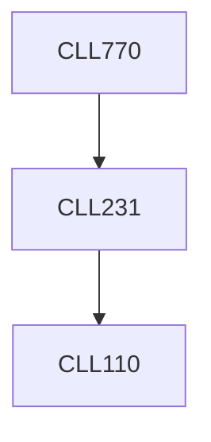

**Credits:** 3 (3-0-0)

**Prerequisites:** [[/Chemical Engineering/CLL231|CLL231]]

**Overlaps with:** MCL826

#### Description
Microfluidics introduction, Basic principles in microfluidics, Governing equations, Basic flow solutions, Surface tension and interfacial energy, Young-Laplace equation, Contact angle, Capillary length and capillary rise boundary conditions. Pressure-driven micro flows, Surface tension driven flows, thin film dynamics, Gas and liquid flows, Boundary conditions, Low Re flows. Couette flows, Poiseuille flow, Stokes drag on a sphere, Two-phase flows, and Thermal transfer. Unsteady Flows, Electro kinetics, Diffusion, Time-dependent flow, Capillary effects, Dispersion. Lab on a chip, Introduction to Microfabrication, Materials, Clean room, Photolithography, Etching, Bulk and Surface micromachining, Wafer bonding, Polymer micro fabrication, Template assisted fabrication, Application of microfluidics.

### Prerequisite Tree

