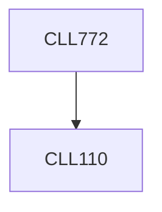

**Credits:** 3 (3-0-0)

**Prerequisites:** [[/Chemical Engineering/CLL110|CLL110]]

#### Description
Classification of fluids under time dependent, time independent and viscoelastic behaviors. Particle level responses: microstructural origins of deformation. Linear and non-linear viscoelasticity. Transport processes in a variety of self-assembling fluids, including surfactant micelles, nano-emulsions, gels, liquid crystalline polymers. Dynamics of rod-like polymers. Static and viscoelastic properties of interfaces. Rheometry and constitutive modeling. Heat transfer in complex fluids: boundary layers. Mixing equipment and its selection.

### Prerequisite Tree

