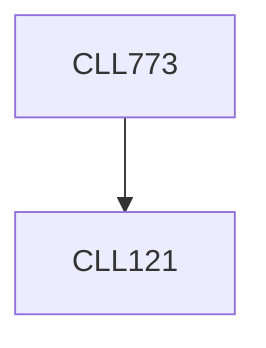

**Credits:** 3 (3-0-0)

**Prerequisites:** [[/Chemical Engineering/CLL121|CLL121]]

**Overlaps with:** PYL202

#### Description
Intermolecular forces. Statistical mechanical approach to thermodynamic potentials. Characterization of free energy curves. Entropically driven phase separation, nucleation and spontaneous phase separations in complex fluids. Characterization of structures: Minkowski functionals. Phase separation in confinement. Mean field theories for phase transition, their break-down, introduction to field theory. Thermodynamics of colloidal systems and polymers.

### Prerequisite Tree

