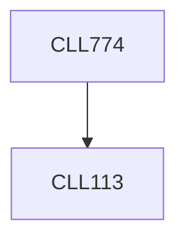

**Credits:** 3 (3-0-0)

**Prerequisites:** [[/Chemical Engineering/CLL113|CLL113]]

**Overlaps with:** MCL315

#### Description
Simulation techniques: Molecular Dynamics, Brownian Dynamics, Monte-Carlo, Discrete Element Method and Lattice Boltzmann Simulations. Force fields and interactions. Statistical measures and trajectory analysis to determine structure (e.g., radial distribution function) and properties (e.g., self-diffusivity, shear-dependent viscosity) of complex fluids.

### Prerequisite Tree

