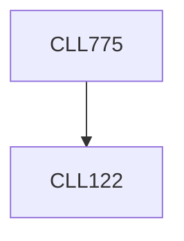

**Credits:** 3 (3-0-0)

**Prerequisites:** [[/Chemical Engineering/CLL122|CLL122]]

**Overlaps with:** PTL719

#### Description
Modeling of step-growth, chain-growth and non-linear polymerization in homogeneous and heterogeneous conditions. Design of CSTR, plug flow, batch and multistep reactors for different polymerization reactions. Control and optimization of polymer reactors, Mathematical modeling and analysis of polymer processing units.

### Prerequisite Tree

