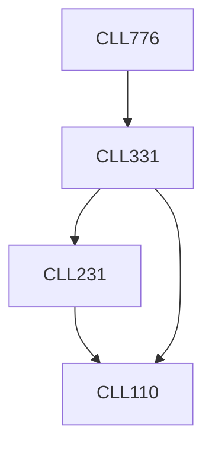

**Credits:** 3 (3-0-0)

**Prerequisites:** [[/Chemical Engineering/CLL331|CLL331]]

#### Description
Continuum mechanics, statistical physics and rigid body dynamics approaches to understand microscopic and macroscopic behavior of granular materials. Constitutive modeling and rheology of granular materials. Advanced simulation techniques for particle dynamics. Design of flow and handling systems for granular materials.

### Prerequisite Tree

