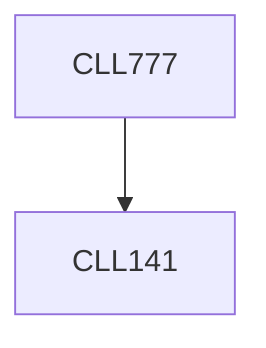

**Credits:** 3 (3-0-0)

**Prerequisites:** [[/Chemical Engineering/CLL141|CLL141]]

#### Description
An overview of various technologies based on complex fluids and relate them to fundamental principles of thermodynamics and transport phenomena in complex fluids, e.g., how to manipulate micro-structures and their environment to achieve new products with desired properties. Case studies involving assembly, stability and applications of colloids, emulsions, suspensions, polymer melts and granular materials.

### Prerequisite Tree

